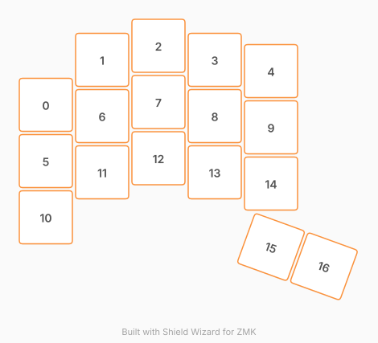

# ZMK Configuration for meow

*Generated by Shield Wizard for ZMK*



Download compiled firmware from the Actions tab. <https://zmk.dev/docs/user-setup#installing-the-firmware>

Edit your keymap <https://zmk.dev/docs/keymaps>.
User keymap is located at [`config/meow.keymap`](config/meow.keymap).

-----

<details>
<summary>
Shield Wizard Debug Information
</summary>

In case of broken configuration, here is the Shield Wizard internal data used to generate this configuration:

Commit: 84a348b08cf4fec4a5441a46147e9a345b10ffab

```json
{"name":"meow","shield":"meow","dongle":true,"modules":[],"layout":[{"id":"01M34FXFRJZADQ0EB6JX0K7A6A","part":0,"row":0,"col":0,"w":1,"h":1,"x":0,"y":1.05,"r":0,"rx":0,"ry":0},{"id":"01M34FXFRJH261T7CGQ2PXXPNX","part":0,"row":0,"col":1,"w":1,"h":1,"x":1,"y":0.25,"r":0,"rx":0,"ry":0},{"id":"01M34FXFRJRSBC1JTJB33Y7MK3","part":0,"row":0,"col":2,"w":1,"h":1,"x":2,"y":0,"r":0,"rx":0,"ry":0},{"id":"01M34FXFRJZNKNVYKBKJD80KG6","part":0,"row":0,"col":3,"w":1,"h":1,"x":3,"y":0.25,"r":0,"rx":0,"ry":0},{"id":"01M34FXFRJBAY5J2XJRAMRYD48","part":0,"row":0,"col":4,"w":1,"h":1,"x":4,"y":0.45,"r":0,"rx":0,"ry":0},{"id":"01M34FXFRJ5DBRCB6SPBVKD37F","part":0,"row":1,"col":0,"w":1,"h":1,"x":0,"y":2.05,"r":0,"rx":0,"ry":0},{"id":"01M34FXFRJ69TRTPBFRATQWHEZ","part":0,"row":1,"col":1,"w":1,"h":1,"x":1,"y":1.25,"r":0,"rx":0,"ry":0},{"id":"01M34FXFRJTV0JMP283W88E117","part":0,"row":1,"col":2,"w":1,"h":1,"x":2,"y":1,"r":0,"rx":0,"ry":0},{"id":"01M34FXFRJN0J406X4893QBH8F","part":0,"row":1,"col":3,"w":1,"h":1,"x":3,"y":1.25,"r":0,"rx":0,"ry":0},{"id":"01M34FXFRJYCYMKCWBFVREX9HD","part":0,"row":1,"col":4,"w":1,"h":1,"x":4,"y":1.45,"r":0,"rx":0,"ry":0},{"id":"01M34FXFRJ22DGFDQ5NYC0Q1GZ","part":0,"row":2,"col":0,"w":1,"h":1,"x":0,"y":3.05,"r":0,"rx":0,"ry":0},{"id":"01M34FXFRJYP66SJV7K1JSQCT4","part":0,"row":2,"col":1,"w":1,"h":1,"x":1,"y":2.25,"r":0,"rx":0,"ry":0},{"id":"01M34FXFRJFFXGQ51WZ8EWXA87","part":0,"row":2,"col":2,"w":1,"h":1,"x":2,"y":2,"r":0,"rx":0,"ry":0},{"id":"01M34FXFRJRQZXQAW8M0M1NJYW","part":0,"row":2,"col":3,"w":1,"h":1,"x":3,"y":2.25,"r":0,"rx":0,"ry":0},{"id":"01M34FXFRJ1T8RXR0ZNY7AW20A","part":0,"row":2,"col":4,"w":1,"h":1,"x":4,"y":2.45,"r":0,"rx":0,"ry":0},{"id":"01M34FXFRJ5YEG79Z90BJJE0AS","part":0,"row":3,"col":4,"w":1,"h":1,"x":4,"y":3.58,"r":20,"rx":4.5,"ry":4.08},{"id":"01M34FXFRJ0WKBPHPRP0YDQ0V2","part":0,"row":3,"col":5,"w":1,"h":1,"x":4.94,"y":3.922,"r":20,"rx":5.44,"ry":4.422}],"parts":[{"name":"left","controller":"nice_nano_v2","pins":{"d9":{"usage":"kscan","kscan":"01M34FYV5QE5JCEXF8NXGNBAEF","role":"input"},"d8":{"usage":"kscan","kscan":"01M34FYV5QE5JCEXF8NXGNBAEF","role":"input"},"d7":{"usage":"kscan","kscan":"01M34FYV5QE5JCEXF8NXGNBAEF","role":"input"},"d6":{"usage":"kscan","kscan":"01M34FYV5QE5JCEXF8NXGNBAEF","role":"input"},"d5":{"usage":"kscan","kscan":"01M34FYV5QE5JCEXF8NXGNBAEF","role":"input"},"d4":{"usage":"kscan","kscan":"01M34FYV5QE5JCEXF8NXGNBAEF","role":"input"},"d3":{"usage":"kscan","kscan":"01M34FYV5QE5JCEXF8NXGNBAEF","role":"input"},"d2":{"usage":"kscan","kscan":"01M34FYV5QE5JCEXF8NXGNBAEF","role":"input"},"d1":{"usage":"kscan","kscan":"01M34FYV5QE5JCEXF8NXGNBAEF","role":"input"},"d10":{"usage":"kscan","kscan":"01M34FYV5QE5JCEXF8NXGNBAEF","role":"input"},"d16":{"usage":"kscan","kscan":"01M34FYV5QE5JCEXF8NXGNBAEF","role":"input"},"d14":{"usage":"kscan","kscan":"01M34FYV5QE5JCEXF8NXGNBAEF","role":"input"},"d15":{"usage":"kscan","kscan":"01M34FYV5QE5JCEXF8NXGNBAEF","role":"input"},"d18":{"usage":"kscan","kscan":"01M34FYV5QE5JCEXF8NXGNBAEF","role":"input"},"d19":{"usage":"kscan","kscan":"01M34FYV5QE5JCEXF8NXGNBAEF","role":"input"},"d20":{"usage":"kscan","kscan":"01M34FYV5QE5JCEXF8NXGNBAEF","role":"input"},"d21":{"usage":"kscan","kscan":"01M34FYV5QE5JCEXF8NXGNBAEF","role":"input"}},"kscans":[{"kind":"direct","id":"01M34FYV5QE5JCEXF8NXGNBAEF","mode":"gnd"}],"keys":{"01M34FXFRJ0WKBPHPRP0YDQ0V2":{"input":"d9"},"01M34FXFRJ5YEG79Z90BJJE0AS":{"input":"d8"},"01M34FXFRJ1T8RXR0ZNY7AW20A":{"input":"d1"},"01M34FXFRJYCYMKCWBFVREX9HD":{"input":"d14"},"01M34FXFRJBAY5J2XJRAMRYD48":{"input":"d21"},"01M34FXFRJ22DGFDQ5NYC0Q1GZ":{"input":"d7"},"01M34FXFRJYP66SJV7K1JSQCT4":{"input":"d6"},"01M34FXFRJFFXGQ51WZ8EWXA87":{"input":"d5"},"01M34FXFRJRQZXQAW8M0M1NJYW":{"input":"d4"},"01M34FXFRJ5DBRCB6SPBVKD37F":{"input":"d3"},"01M34FXFRJ69TRTPBFRATQWHEZ":{"input":"d2"},"01M34FXFRJTV0JMP283W88E117":{"input":"d10"},"01M34FXFRJN0J406X4893QBH8F":{"input":"d16"},"01M34FXFRJZADQ0EB6JX0K7A6A":{"input":"d15"},"01M34FXFRJH261T7CGQ2PXXPNX":{"input":"d18"},"01M34FXFRJRSBC1JTJB33Y7MK3":{"input":"d19"},"01M34FXFRJZNKNVYKBKJD80KG6":{"input":"d20"}},"encoders":[],"buses":{}},{"name":"right","controller":"nice_nano_v2","pins":{"d9":{"usage":"kscan","kscan":"01M34GWE1A6B2BNMQ9PRX1AJ3Z","role":"input"},"d8":{"usage":"kscan","kscan":"01M34GWE1A6B2BNMQ9PRX1AJ3Z","role":"input"},"d7":{"usage":"kscan","kscan":"01M34GWE1A6B2BNMQ9PRX1AJ3Z","role":"input"},"d6":{"usage":"kscan","kscan":"01M34GWE1A6B2BNMQ9PRX1AJ3Z","role":"input"},"d5":{"usage":"kscan","kscan":"01M34GWE1A6B2BNMQ9PRX1AJ3Z","role":"input"},"d4":{"usage":"kscan","kscan":"01M34GWE1A6B2BNMQ9PRX1AJ3Z","role":"input"},"d3":{"usage":"kscan","kscan":"01M34GWE1A6B2BNMQ9PRX1AJ3Z","role":"input"},"d2":{"usage":"kscan","kscan":"01M34GWE1A6B2BNMQ9PRX1AJ3Z","role":"input"},"d1":{"usage":"kscan","kscan":"01M34GWE1A6B2BNMQ9PRX1AJ3Z","role":"input"},"d10":{"usage":"kscan","kscan":"01M34GWE1A6B2BNMQ9PRX1AJ3Z","role":"input"},"d16":{"usage":"kscan","kscan":"01M34GWE1A6B2BNMQ9PRX1AJ3Z","role":"input"},"d14":{"usage":"kscan","kscan":"01M34GWE1A6B2BNMQ9PRX1AJ3Z","role":"input"},"d15":{"usage":"kscan","kscan":"01M34GWE1A6B2BNMQ9PRX1AJ3Z","role":"input"},"d18":{"usage":"kscan","kscan":"01M34GWE1A6B2BNMQ9PRX1AJ3Z","role":"input"},"d19":{"usage":"kscan","kscan":"01M34GWE1A6B2BNMQ9PRX1AJ3Z","role":"input"},"d20":{"usage":"kscan","kscan":"01M34GWE1A6B2BNMQ9PRX1AJ3Z","role":"input"},"d21":{"usage":"kscan","kscan":"01M34GWE1A6B2BNMQ9PRX1AJ3Z","role":"input"}},"kscans":[{"kind":"direct","id":"01M34GWE1A6B2BNMQ9PRX1AJ3Z","mode":"gnd"}],"keys":{},"encoders":[],"buses":{}}]}
```

</details>
